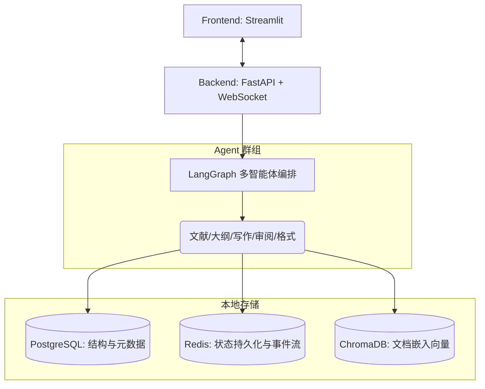

# Vibe Paper - 去中心化多智能体论文写作助手

基于 `FastAPI` + `LangGraph` + `Streamlit` 构建的多智能体学术论文写作辅助系统。该系统针对独立研究人员设计，完全在本地电脑运行，确保学术数据的绝对安全隐私。

## 🌟 架构概览



**核心特性：**
1. **去中心化状态机**：基于 LangGraph 编排 5 个专家 Agent，它们通过条件边自主决定接下来的执行路径（如审阅不通过自动路由回写作者修改）。
2. **本地混合存储架构**：
   - 结构数据存放在本地企业级关系型数据库 `PostgreSQL`。
   - 包含复杂大维度的文献嵌入向量保存在内嵌运行的 `ChromaDB`，无需安装庞大的独立服务。
   - 实时的 Agent 生成进度通过内存级 `Redis` Streams 推送至前端监控。
3. **RAG 语义检索**：支持 PyMuPDF/GROBID 引擎解析文献结构，结合 Qwen Embedding 模型进行高精度切块和语义检索。

---

## 🚀 环境准备与安装步骤

### 1. 下载并安装必要环境
本系统由于完全本地化运行，你需要确保以下两个底层组件在你的电脑后台服务中运行。

| 环境与服务 | 详情说明 | 是否必需 |
|------|---------|------|
| Python 3.9+ | 运行环境基础的语言 | **必须** |
| PostgreSQL | 用于存储项目的核心文字、层级结构。去官网下载 Windows 安装包即可（密码建议为 `changeme`）。 | **必须** |
| Redis | 用于维持系统缓存与 Agent 的消息队列。建议使用 Windows 版本 `.msi` 开启后台服务即可。 | **必须** |
| GROBID (可选) | 提供极致的结构化文献自动解析引擎（运行于端口 `8070`）。如果未配置则回退降级到纯文本提取。 | 可选 |


### 2. 初始化数据库 (仅首次)
在安装好 PostgreSQL 后，你需要为本项目单独建立一个“库”（名称为 `vibe_paper`）。
打开你的电脑终端（PowerShell / CMD），启动以下命令并输入口令（例：`changeme`）：
```bash
psql -U postgres -h localhost -c "CREATE DATABASE vibe_paper;"
```

### 3. 安装 Python 依赖项目库
回到本代码项目的文件夹下：
```bash
pip install -r requirements.txt
```

### 4. 确认配置变量文件 `.env`
我们在项目目录下放置了 `.env` 作为唯一配置文件，默认内容直接兼容我们在上面建好的数据库。
> 如果你的大语言模型 API 和 PostgreSQL 管理密码与下方的不一致，你需要修改它们。

```env
# ====== Qwen / DashScope ======
DASHSCOPE_API_KEY=换成你的通义千问API_KEY
QWEN_MODEL=qwen3.5-flash
QWEN_EMBEDDING_MODEL=text-embedding-v3

# ====== 结构数据 / PostgreSQL ======
POSTGRES_HOST=localhost
POSTGRES_PORT=5432
POSTGRES_USER=postgres
POSTGRES_PASSWORD=changeme
POSTGRES_DB=vibe_paper

# ====== 缓存与监控 / Redis ======
REDIS_HOST=localhost
REDIS_PORT=6379
REDIS_DB=0
```

---

## 🕹️ 启动服务

为了防止依赖或日志堵塞，请你打开**两个单独的终端**对应启动下面的服务。

### 终端 1 (启动后端引擎)：
该步骤在第一次运行时，连接成功后它会自动前往 `PostgreSQL` 内帮助我们把数据表自动“装修”完毕。
```bash
uvicorn backend.main:app --reload --port 8000
```
*(如果看见 `Application startup complete.` 说明后台完美运转。后端文档：http://localhost:8000/docs)*

### 终端 2 (启动可视化前端)：
```bash
streamlit run frontend/app.py --server.port 8501
```
*(如果没有自动跳出浏览器，请点击终端中的 Local URL 连接。)*

---

## 📖 使用操作图谱

进入 `http://localhost:8501` 系统面板后：
1. **项目管理**：请先创建一个专属论文，设置你的标题、要求。
2. **文献管理**：在这里上传你在寻找的学术参考 PDF。后端会自动将内容拆块、向量化存在内嵌 ChromaDB 数据中。
3. **Agent 监控台**：这就像一个驾驶舱。在此开着窗口，当你发出写作指令时，你可以在这看着多个 AI 专家的交互流转。
4. **论文编辑区**：系统的大本营。输入你的大纲或修改要求，随时启动 Agent。你也能借此自己审阅、更改 AI 落地的成果。

---

## 📂 核心代码目录结构
项目核心拆分为前后端分离的现代化架构结构。
```text
vibe_paper/
├── backend/                  【FastAPI核心层】
│   ├── main.py               - 启动中心
│   ├── config.py             - 环境拦截与管理
│   ├── database/             - Redis / PG_ORM / Chroma 内嵌存储基石
│   ├── rag/                  - RAG 向量解析提取模块
│   ├── agents/               - LangGraph 决策网络核心图谱
│   └── api/                  - 中间件 REST 与 WS 数据路由流转
│
├── frontend/                 【Streamlit表现层】
│   ├── app.py                - 唯一大门入口
│   ├── pages/                - 分支展示页 (4 大页面模块)
│   ├── components/           - UX 复用元件 (测边框按钮等)
│   └── utils.py              - UI/UX 的后端接口调度库
│
├── .env                      - 本地全局环境加密配置 (已忽略同步)
├── requirements.txt          - 运行强依赖合集
└── README.md
```
